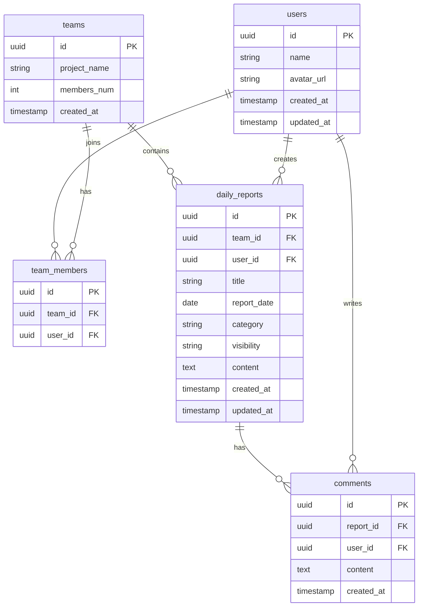

# Daily Report App

## 概要

Daily Report Appは、チーム内で日報を共有・管理するためのWebアプリケーションです。  
ユーザーは日報の投稿、閲覧、編集、コメントを行うことができます。

チーム単位で日報を管理することで、業務状況の可視化とコミュニケーション促進を目的としています。

---

## サービスURL

（デプロイ後に記載）

---

## 使用技術

### フロントエンド

- Next.js (App Router)
- React
- TypeScript
- Tailwind CSS

### バックエンド

- Supabase
- PostgreSQL
- Supabase Auth

### インフラ

- Vercel（予定）

### 開発ツール

- Git
- GitHub
- Figma
- Mermaid

---

## 機能一覧

### 認証機能

- ユーザー登録
- ログイン
- ログアウト
- パスワードリセット

### ユーザー機能

- プロフィール編集
- アバター設定

### 日報機能

- 日報作成
- 日報一覧表示
- 日報詳細表示
- 日報編集
- 日報削除

### コメント機能

- コメント投稿
- コメント一覧表示

### チーム機能

- チーム参加
- チーム単位の日報管理

---

## 画面一覧

| 画面               | URL                |
| ------------------ | ------------------ |
| ログイン           | /login             |
| 新規登録           | /signup            |
| パスワードリセット | /reset-password    |
| プロフィール       | /profile           |
| 日報一覧           | /reports           |
| 日報作成           | /reports/new       |
| 日報詳細           | /reports/[id]      |
| 日報編集           | /reports/[id]/edit |
| チーム             | /team              |

---

## ER図

## 開発者

個人開発

担当：

- 要件定義
- ER設計
- 画面設計
- UI設計
- フロントエンド開発
- バックエンド開発
- DB設計
- テスト

---

## 開発背景

日報管理を効率化し、チーム内の情報共有を簡単にするため開発しました。

設計から実装までをモダンな技術スタックで一通り経験することを目的としています。
