# Daily Report App

## 概要

Daily Report Appは、チーム内で日報を共有・管理するためのWebアプリケーションです。
ユーザーはチームを作成または参加し、日々の業務内容を日報として投稿・共有することができます。

日報の投稿・編集・コメント機能により、チーム内の情報共有を円滑にし、業務状況の可視化とコミュニケーション促進を目的としています。

また、認証・権限制御（RLS）を実装し、チーム単位で安全にデータ管理できる設計になっています。

さらに、CI/CD・自動テスト・型安全な開発体制を導入し、品質を担保しながら継続的に改善できる環境を構築しています。

---

## サービスURL

https://devstep-daily-report.vercel.app/

---

## デモ動画 

https://youtu.be/Fy3muoUDGW4?si=shtcckTlFXYHVgfw

---

## スクリーンショット

### 認証画面

| ログイン                       | 新規登録                        | パスワード再設定              |
| ------------------------------ | ------------------------------- | ----------------------------- |
| 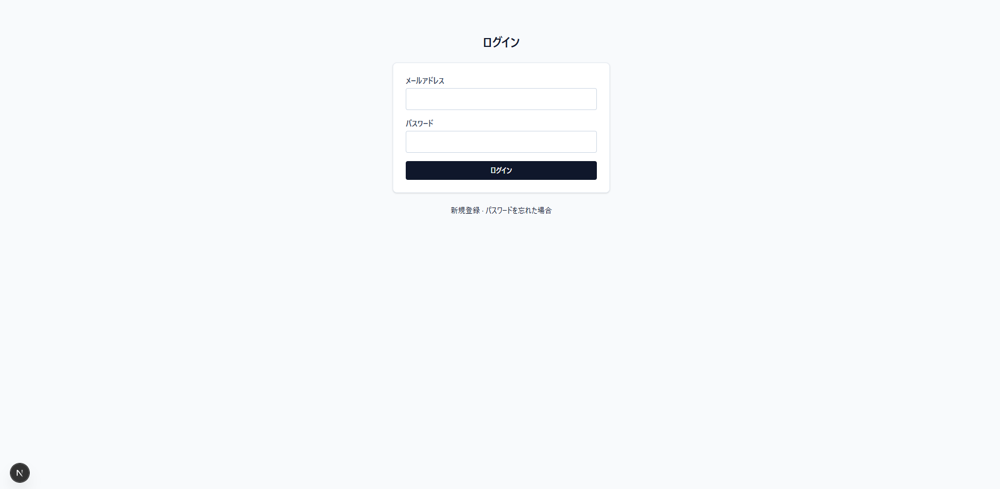 | 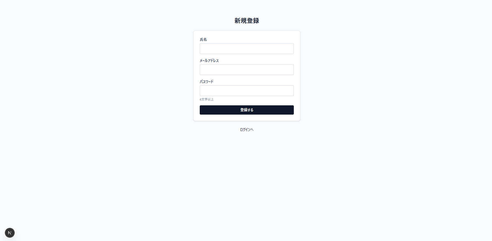 | 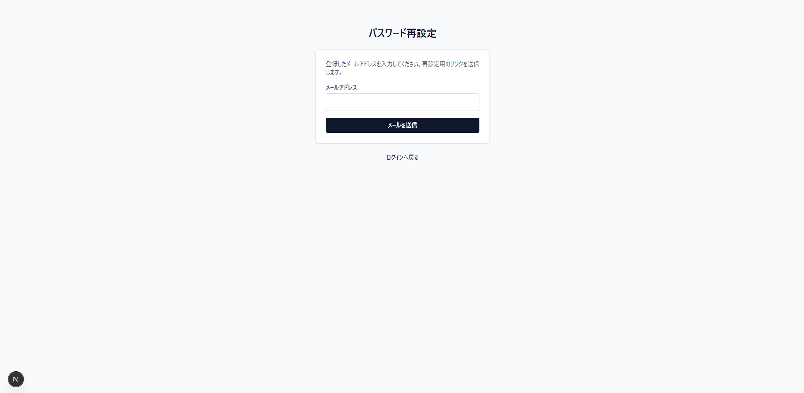 |

### 主要機能

| 日報一覧                     | 日報作成                        | チーム                        | プロフィール                     |
| ---------------------------- | ------------------------------- | ----------------------------- | -------------------------------- |
| 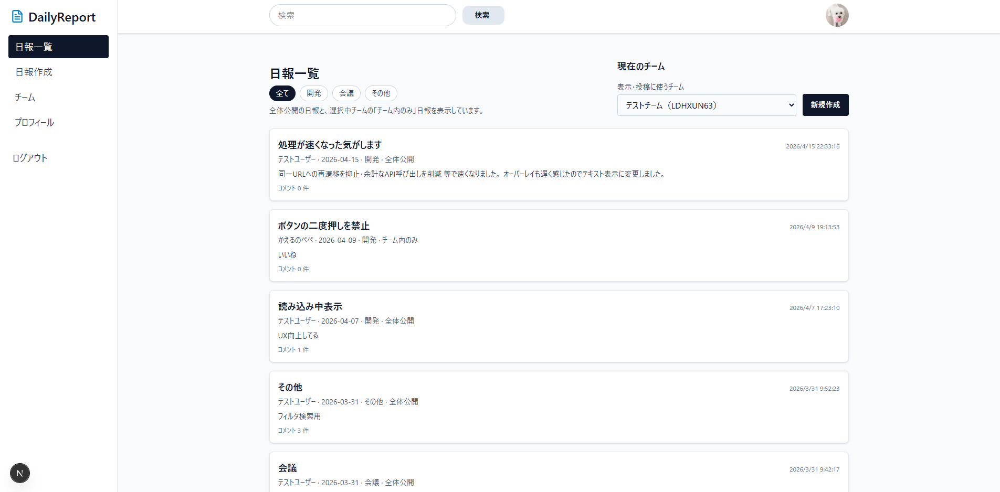 | 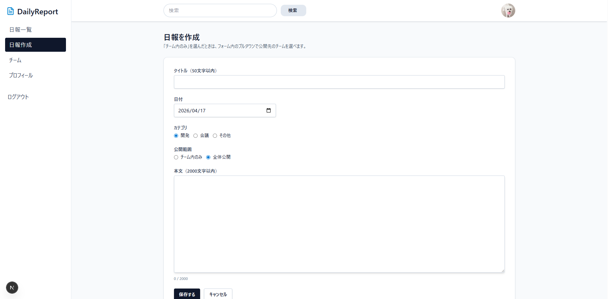 | 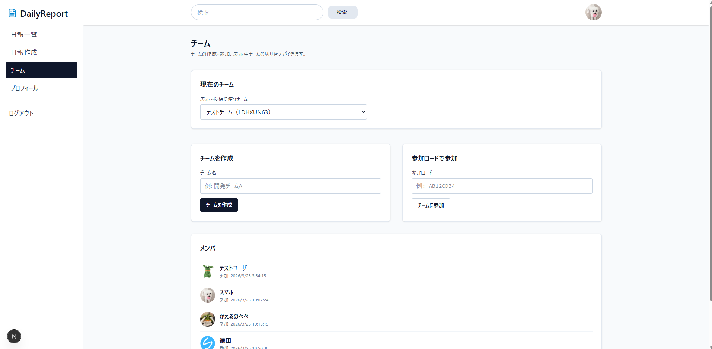 | 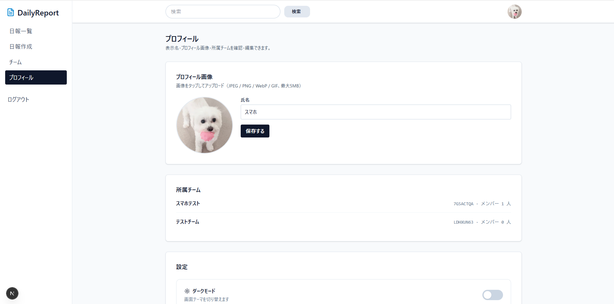 |

### ダークモード

| 一覧                              | 作成                                 |
| --------------------------------- | ------------------------------------ |
| 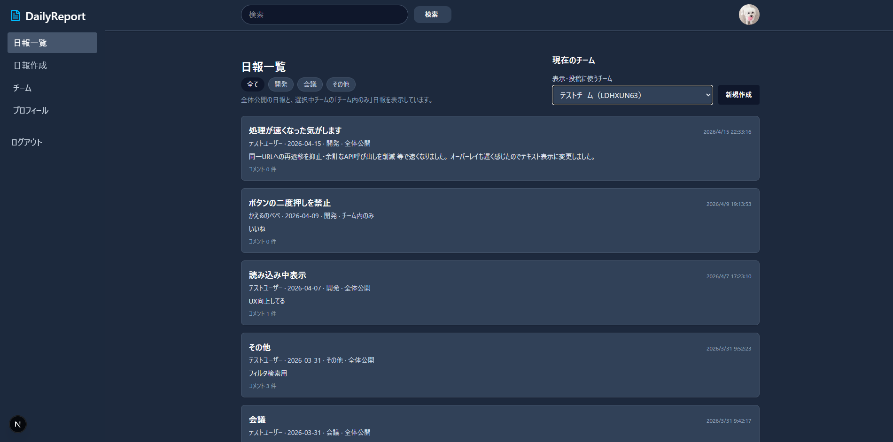 | 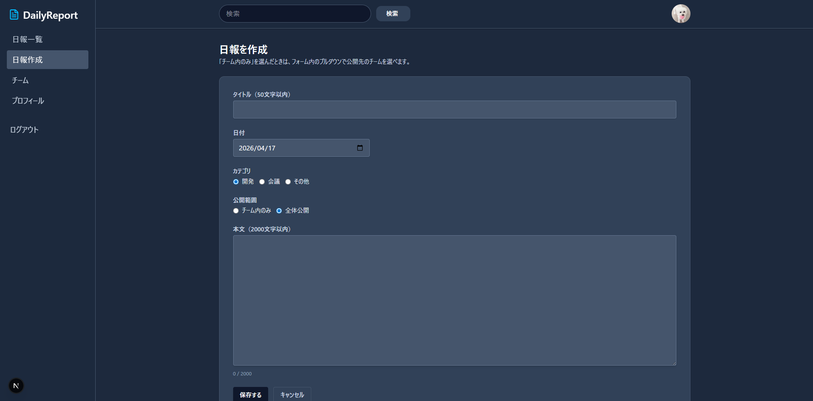 |

### スマホ版

| ホーム                          | サイドバー                       |
| ------------------------------- | -------------------------------- |
| 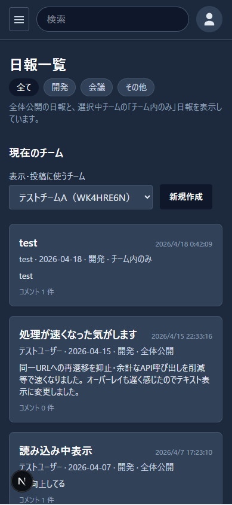 | 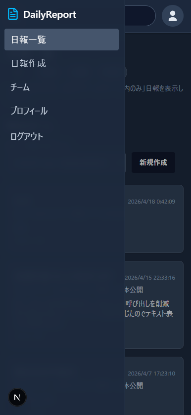 |

---

## 使用技術

### フロントエンド

- Next.js 14（App Router）
- React
- TypeScript
- Tailwind CSS

### バックエンド

- Supabase
- PostgreSQL
- Supabase Auth（JWT認証）

### インフラ

- Vercel（デプロイ）
- Supabase
- GitHub Actions（CI/CD）

### 開発ツール

- Git / GitHub
- Vitest
- Playwright
- ESLint
- Prettier
- Figma
- Mermaid

---

## 主な機能

### 認証機能

- ユーザー登録（メール認証）
- ログイン
- ログアウト
- パスワードリセット
- 認証状態によるアクセス制御

### ユーザー機能

- プロフィール編集
- ユーザー名変更
- アバター画像設定
- ダークモード切替

### チーム機能

- チーム作成
- 参加コードによるチーム参加
- チーム単位での日報管理
- RLSによる権限制御

### 日報機能

- 日報作成
- 日報一覧表示
- 日報詳細表示
- 日報編集
- 日報削除
- 日報検索
- カテゴリ絞り込み

### コメント機能

- コメント投稿
- コメント一覧表示
- コメントいいね

### エラーハンドリング

- 404ページ
- バリデーションエラー表示
- 認証エラー制御

---

## 画面一覧

| 画面               | URL                |
| ------------------ | ------------------ |
| ログイン           | /login             |
| 新規登録           | /signup            |
| パスワードリセット | /reset-password    |
| チーム管理         | /team              |
| 日報一覧           | /reports           |
| 日報作成           | /reports/new       |
| 日報詳細           | /reports/[id]      |
| 日報編集           | /reports/[id]/edit |
| プロフィール       | /profile           |

---

## ER図

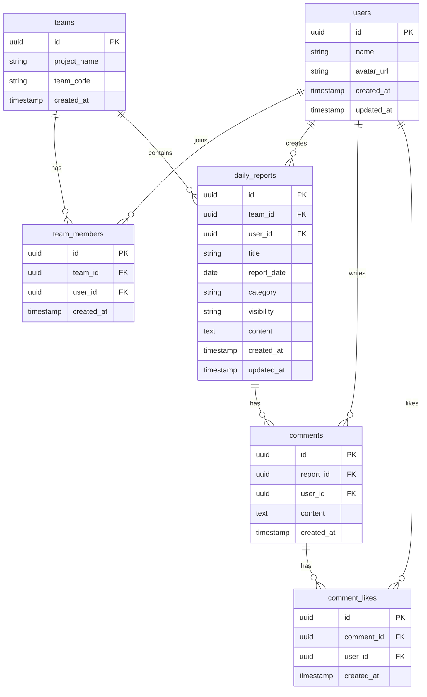

---

## テスト

### 単体テスト（Vitest）

主要コンポーネント・関数に対して単体テストを実施しています。

#### 合計44テストケース
(カバレッジ99.02%)

#### 内訳：

- ラベル変換関数のテスト(6)

- チーム操作の Server Action テスト(3)

- 日報バリデーションスキーマのテスト(3)

- TeamSelect コンポーネントテスト(4)

- ReportForm コンポーネントテスト(28)

#### テスト特徴：

- integration テスト重視：コンポーネント・バリデーション・サーバー処理を統合的に検証
- エッジケース対応：チーム未参加、エラー時の処理などを細かくテスト
- モック活用：Next.js ルーター、Supabase、カスタムフック を適切にモック
- UI テスト：fireEvent で実際のユーザー操作をシミュレート

### E2Eテスト（Playwright）

実際のユーザー操作を想定したブラウザテストを実施しています。

#### 合計14シナリオ

#### 内訳：

- 認証ページ（4）
  - ログイン画面の基本要素
  - ログイン→新規登録遷移
  - 新規登録の入力項目
  - パスワード再設定へ遷移

- 主要機能（5）
  - 日報作成・検索・絞り込み
  - 日報編集
  - チーム作成
  - プロフィール編集
  - 日報削除

- アクセス制御（3）
  - /reports/new のリダイレクト
  - /team のリダイレクト
  - /profile のリダイレクト

- ルーティング（2）
  - トップアクセスのリダイレクト
  - 保護ページへの未ログインアクセス

---

## CI/CD

GitHub Actions + Vercel により、自動テスト / 自動デプロイを実装しています。

### フロー

```txt
featureブランチ作業
↓
Pull Request作成
↓
GitHub Actions実行
- Unit Test
- E2E Test
↓
成功時のみMerge可能
↓
main反映
↓
Vercel自動デプロイ
```

## セットアップ手順

### 1. リポジトリをクローン

```bash
git clone https://github.com/Nagitokuta/devstep-daily-report
cd devstep-daily-report
```

### 2. パッケージをインストール

```bash
npm install
```

### 3. 環境変数を設定

`.env.local` を作成し、以下を設定してください。

```env
NEXT_PUBLIC_SUPABASE_URL=your_supabase_url
NEXT_PUBLIC_SUPABASE_ANON_KEY=your_supabase_anon_key
```

### 4. 開発サーバー起動

```bash
npm run dev
```

ブラウザで以下へアクセスします。

```txt
http://localhost:3000
```

---

## テスト実行方法

### 単体テスト（Vitest）

```bash
npm run test
```

または

```bash
npx vitest run
```

### カバレッジ付き実行

```bash
npx vitest run --coverage
```

### E2Eテスト（Playwright）

```bash
npx playwright test
```

### Playwright UIモード

```bash
npx playwright test --ui
```

---

## デプロイ方法

### 本番環境（Vercel）

mainブランチへマージすると、自動でVercelにデプロイされます。

```txt
featureブランチ作業
↓
Pull Request作成
↓
レビュー / テスト通過
↓
mainへMerge
↓
Vercel自動デプロイ
```

### 手動デプロイ（任意）

```bash
vercel --prod
```

---

## 開発プロセス

### ブランチ運用

```txt
main
 └ feature/〇〇
 └ fix/〇〇
 └ refactor/〇〇
```

### 開発フロー

```txt
1. featureブランチ作成
2. 実装
3. Unit Test実行
4. E2E Test実行
5. Pull Request作成
6. GitHub Actionsで自動テスト
7. レビュー
8. mainへMerge
9. 自動デプロイ
```

### 品質管理

- mainブランチ直接push禁止
- Pull Request必須
- テスト成功時のみMerge可能
- GitHub Actionsによる自動テスト
- TypeScript strict mode による型安全担保

### コミットルール（一例）

```txt
feat: 新機能追加
fix: バグ修正
refactor: リファクタリング
test: テスト追加・修正
docs: README更新
style: 見た目調整
```

---

## 型安全への取り組み

TypeScript strict mode を有効化しています。

### 実施内容

- strict: true
- any型排除
- Props型定義
- APIレスポンス型定義
- null安全性担保

### 効果

- 実行時エラー削減
- 保守性向上
- リファクタリングしやすい設計

---

## 技術的な工夫点

- Supabase RLSによる安全なデータアクセス制御
- Next.js Middlewareによる認証ガード
- ローディング管理によるUX改善
- レスポンシブ対応（PC / スマホ）
- ダークモード対応
- CI/CDによる品質担保
- 型安全な開発体制

---

## 今後の改善予定

- 通知機能
- チーム管理者権限
- リアルタイム更新
- テストカバレッジ向上
- パフォーマンス最適化

---

## 開発者

個人開発

### 担当工程

- 要件定義
- ER設計
- UI / UX設計
- フロントエンド開発
- バックエンド開発
- DB設計
- RLS設計
- テスト設計
- CI/CD構築
- インフラ設定

---

## 開発背景

日報管理を効率化し、チーム内の情報共有を簡単にできるアプリを開発しました。

また、Next.js + Supabase を用いたモダンなWebアプリ開発において、

- 認証
- DB設計
- 権限制御
- UI実装
- テスト
- CI/CD
- デプロイ

まで一貫して実践し、実務を意識した開発経験を積むことを目的としています。
