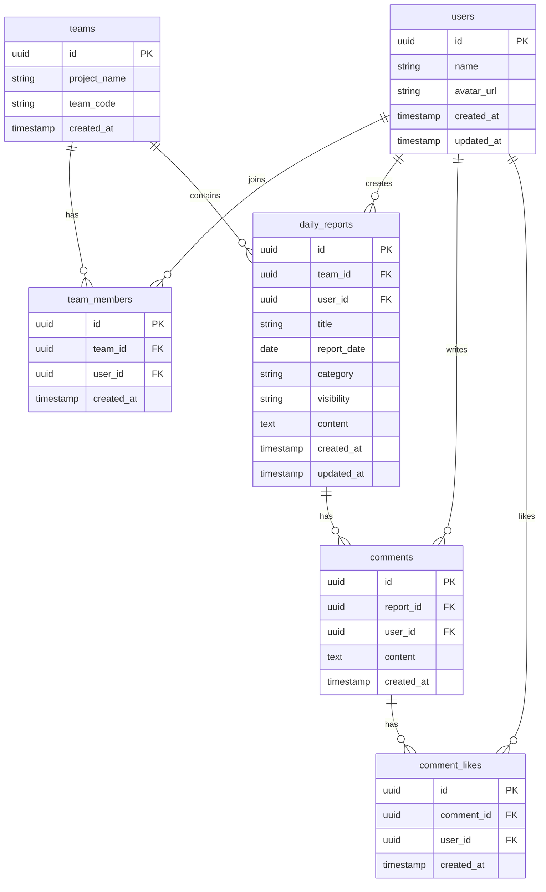

# Daily Report App

## 概要

Daily Report Appは、チーム内で日報を共有・管理するためのWebアプリケーションです。  
ユーザーはチームを作成または参加し、日々の業務内容を日報として投稿・共有することができます。

日報の投稿・編集・コメント機能により、チーム内の情報共有を円滑にし、業務状況の可視化とコミュニケーション促進を目的としています。

また、認証・権限制御（RLS）を実装し、チーム単位で安全にデータ管理できる設計になっています。

---

## サービスURL

[https://devstep-daily-report.vercel.app/](https://devstep-daily-report.vercel.app/)

---

## 使用技術

### フロントエンド

- Next.js 14（App Router）
- React
- TypeScript
- Tailwind CSS

### バックエンド

- Supabase
- PostgreSQL
- Supabase Auth（JWT認証）

### インフラ

- Vercel（デプロイ）
- Supabase（BaaS）

### 開発ツール

- Git
- GitHub
- Figma（UI設計）
- Mermaid（ER図作成）

---

## 主な機能

### 認証機能

- ユーザー登録（メール認証）
- ログイン
- ログアウト
- パスワードリセット
- 認証状態による画面アクセス制御

### ユーザー機能

- プロフィール編集
- ユーザー名変更
- アバター画像設定
- ダークモード切替

### チーム機能

- チーム作成
- 参加コードによるチーム参加
- チーム単位での日報管理
- メンバー権限に基づいたデータアクセス制御（RLS）

### 日報機能

- 日報作成
- 日報一覧表示
- 日報詳細表示
- 日報編集
- 日報削除
- 日報検索・カテゴリ絞り込み

### コメント機能

- コメント投稿
- コメント一覧表示
- コメントいいね

### エラーハンドリング

- 404ページ実装
- バリデーションエラーを表示

---

## 画面一覧

| 画面        | URL                |
| --------- | ------------------ |
| ログイン      | /login             |
| 新規登録      | /signup            |
| パスワードリセット | /reset-password    |
| チーム管理     | /team              |
| 日報一覧      | /reports           |
| 日報作成      | /reports/new       |
| 日報詳細      | /reports/[id]      |
| 日報編集      | /reports/[id]/edit |
| プロフィール    | /profile           |

---

## ER図

## 技術的な工夫点

- Supabase RLS（Row Level Security）による安全なデータアクセス制御
- チーム参加前後での適切な認可設計
- Next.js Middlewareによる認証ガード実装
- ローディング状態管理によるUX改善
- フォームバリデーション実装
- レスポンシブ対応（PC / スマホ）

## 今後の改善予定

- 通知機能
- チーム管理者権限

## 開発者

個人開発

担当：

- 要件定義
- ER設計
- 画面設計
- UI設計
- フロントエンド開発
- バックエンド開発
- DB設計
- RLS設計
- テスト

---

## 開発背景

日報管理を効率化し、チーム内の情報共有を簡単にできるようなアプリを開発しました。

また、Next.js + Supabase を用いたモダンなWebアプリ開発の一連の流れ（設計・認証・DB設計・権限制御・UI実装・デプロイ）を実践的に学ぶことを目的としています。