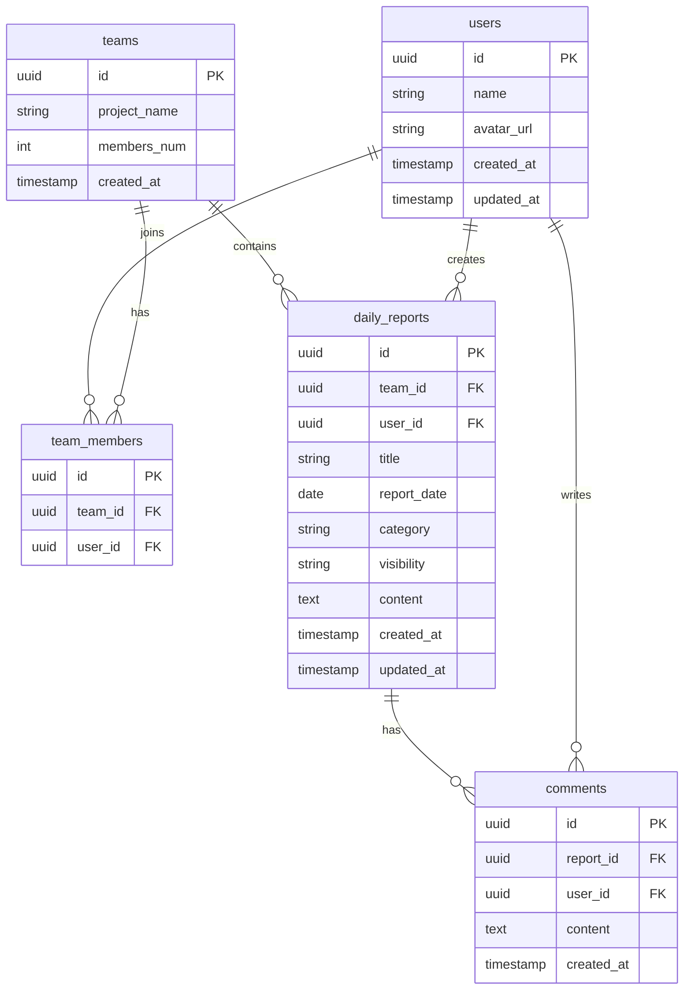

```mermaid
erDiagram

    users {
        uuid id PK
        string name
        string avatar_url
        timestamp created_at
        timestamp updated_at
    }

    teams {
        uuid id PK
        string project_name
        int members_num
        timestamp created_at
    }

    team_members {
        uuid id PK
        uuid team_id FK
        uuid user_id FK
    }

    daily_reports {
        uuid id PK
        uuid team_id FK
        uuid user_id FK
        string title
        date report_date
        string category
        string visibility
        text content
        timestamp created_at
        timestamp updated_at
    }

    comments {
        uuid id PK
        uuid report_id FK
        uuid user_id FK
        text content
        timestamp created_at
    }

    teams ||--o{ team_members : "has"
    users ||--o{ team_members : "joins"
    users ||--o{ daily_reports : "creates"
    users ||--o{ comments : "writes"
    daily_reports ||--o{ comments : "has"
    teams ||--o{ daily_reports : "contains"
```